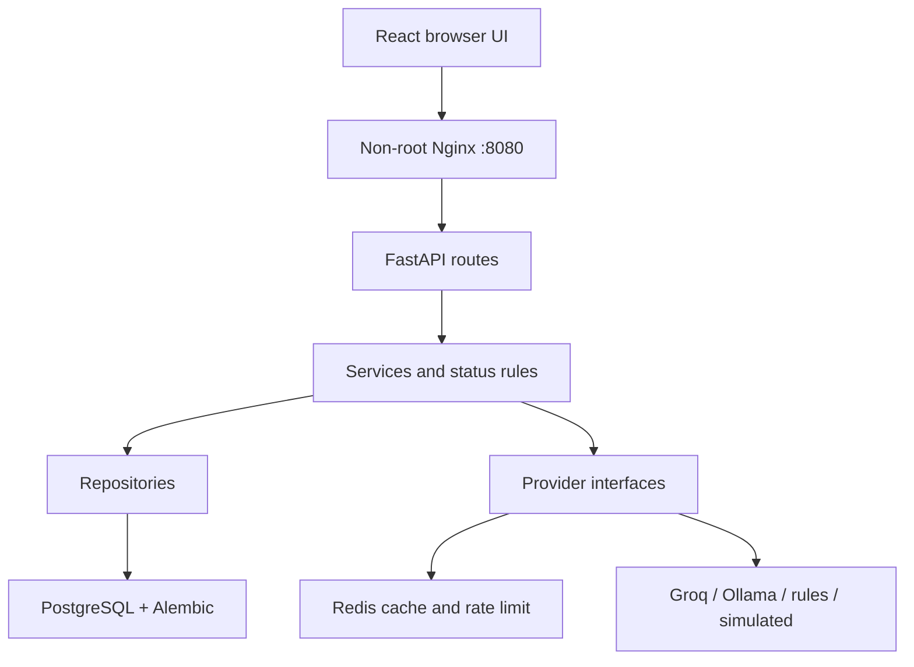

# CivicPulse

[](https://github.com/AT3692/civic-pulse-astra/actions/workflows/ci.yml)
[](https://github.com/AT3692/civic-pulse-astra/actions/workflows/cd.yml)

A municipal complaint intake, AI triage, and operations dashboard for FAST-NUCES Software Construction and Development. Citizens describe an issue; a replaceable provider classifies it; operators work an explicit status queue. Provider failure falls back to deterministic rules without losing the complaint.

## Run locally

Install Docker Engine with Compose v2, Python 3, and Git. From a clean clone:

```bash
git clone --branch feat/civicpulse-milestones-2-4 https://github.com/AT3692/civic-pulse-astra.git
cd civic-pulse-astra
bash scripts/quickstart.sh
```

Open **http://localhost:8080**. The command creates local random secrets if `.env` is absent, builds and starts five containers, runs Alembic, and loads **36 idempotent demo reports**. The default `simulated` provider needs no account, model download, or external AI request. API docs: http://localhost:8000/docs (development only). Set `FRONTEND_PORT` in `.env` if 8080 is occupied. First builds and the Ollama image download may take several minutes.

The clone command selects the implementation branch while the changes await review; `main` still contains Milestone 1. To update statuses, copy the locally generated `OPERATOR_API_KEY` value from your `.env` into the dashboard's operator-key field. Keep that value private. The previously tracked `.env` is removed in this branch; see [the history remediation note](docs/ENV-HISTORY.md).

Select a provider in `.env` and recreate the backend:

```bash
# Optional local AI: download weights once, then set TRIAGE_PROVIDER=ollama in .env.
docker compose exec ollama ollama pull llama3.2:1b
docker compose up -d --force-recreate backend
```

`rules`, `simulated`, `llm` (Groq), and `ollama` share one validated interface. For Groq set `GROQ_API_KEY`; check model availability and account limits before use. See [triage behavior](docs/TRIAGE.md) and [PII decision](docs/adr/0004-pii-and-data-governance.md).

## Architecture



Frontend joins only the Compose `edge` network. Postgres and Redis join only the isolated `internal` network. Backend bridges both, which also permits hosted AI egress. Ollama joins `edge` for model downloads and has no published port. Three named volumes persist data, Redis AOF, and model weights.

The browser uses relative `/api` URLs. Nginx proxies them; no deployment URL or secret is baked into Vite assets. Four backend layers enforce direction: routes → services → repositories/providers. Routes never create sessions or execute SQL. K8s performs migrations in a Job and gates application startup on the expected schema version.

## Application

- **Report:** validation, honest pending state, category/priority/summary/provider receipt.
- **Dashboard:** pagination, category/priority/status filters, 15-second refresh, backend-provided transition actions, verbatim conflict errors.
- **City stats:** category/priority/status aggregates, actual `X-Cache` value, recent provider outcomes, measured triage cache hit rate.
- **Privacy/access:** contact values are stored but omitted from public responses. Public descriptions and locations must not contain sensitive data. Production requires `OPERATOR_API_KEY` for status changes; enter it in the dashboard, where it stays in memory. Demo mode allows updates if the key is empty. This shared-key design is suitable for the assignment; a real municipality needs individual authentication, roles, audit/retention policy, TLS and a backup/restore plan.

## API contract

| Method | Path | Behavior |
|---|---|---|
| POST | `/api/complaints` | 201; field errors 400; Redis rate limit 429 + Retry-After |
| GET | `/api/complaints/{id}` | Complaint or 404; contact is redacted |
| GET | `/api/complaints` | `category`, `priority`, `status`, `page`, `page_size` (1–100), total |
| PATCH | `/api/complaints/{id}/status` | Atomic transition; 409 on invalid/concurrent changes; optional operator key |
| GET | `/api/stats` | 30-second generation cache; `X-Cache: HIT` or `MISS` |
| GET | `/api/meta/providers` | Active provider, last 20 shared outcomes, cache hit rate |
| GET | `/health` | Process liveness, no dependency calls |
| GET | `/ready` | Postgres and Redis reachability; named failures with 503 |
| GET | `/metrics` | Prometheus request/latency/triage/fallback metrics |

The PDF calls these “ten endpoints” but its contract table lists nine method/path combinations; all nine are implemented. Automatic `/docs`, `/redoc`, and `/openapi.json` are also available.

## Test and develop

```bash
python3.12 -m venv .venv
. .venv/bin/activate
pip install -r backend/requirements-dev.txt
(cd backend && pytest --cov=app && mypy app)
ruff check backend scripts
ruff format --check backend scripts
npm ci --prefix frontend
npm --prefix frontend run lint
npm --prefix frontend run typecheck
npm --prefix frontend test
npm --prefix frontend run build
python scripts/check_submission.py
```

Unit tests use an isolated SQLite database and cache double. PostgreSQL/Redis integration tests require `TEST_DATABASE_URL` pointing to an **expendable `civicpulse_test` database** and `TEST_REDIS_URL` pointing to an isolated Redis database. They test migrations both directions, SQL constraints, idempotent seed, real caching, and an atomic concurrent rate limiter. CI supplies these services. Never point this suite at a real deployment.

When changing API schemas: `python scripts/export_openapi.py && npm --prefix frontend run generate:api`. Commit both generated files; CI rejects drift. Vite's development proxy is for `npm run dev` only. Container images always use Nginx's same-origin proxy.

## CI/CD and Kubernetes

- `ci.yml`: Ruff, mypy, ESLint, tsc, ≥65% Python coverage, component tests, image builds without registry publishing, Trivy HIGH/CRITICAL fixable vulnerabilities, strict kubeconform, Compose smoke tests, and a disposable Kubernetes deployment/Ingress/persistence test. Require the **CI / required** aggregate check in branch protection.
- `cd.yml`: runs the whole suite on merged `main`, builds/pushes SHA and latest tags to GHCR, scans resulting digests, emits Syft SBOMs, signs/verifies with Cosign, creates an ephemeral k3d cluster, deploys by **digest**, and smoke-tests Ingress.
- `release.yml`: tests tagged code, builds semver images, and generates release notes.

`latest` is published for convenience and never deployed. CD's runner cluster is a repeatable deployment demonstration, **not a persistent hosted production environment**. It is deleted after evidence upload. See [the runbook](docs/RUNBOOK.md) for creating a local cluster, deploying the same images, private registry access, TLS, rollback, HPA/VPA exercises, and incident response.

Kustomize provides base + dev/prod overlays: namespace, two replicas each of frontend/backend, Postgres StatefulSet/PVC, Redis Deployment/PVC, ClusterIP services, Ingress, ConfigMap, placeholder Secret, migration Job, backend PDB, HPA (2–10, 60% CPU), and data NetworkPolicies. VPA is a separately applied addon because its CRDs must be installed first.

## Delivery and evidence

[Validation results](docs/VALIDATION.md) distinguish checks actually run from checks awaiting Docker/CI. [Evidence instructions](docs/evidence/README.md) cover screenshots, HPA measurements, image/context sizes, persistence, red/green gates, and your ≤5-minute demo. Do not submit placeholders as measurements or fabricate partner reviews, commits, merge conflicts, or video evidence.

Four [ADRs](docs/adr/), [engineering notes](docs/ENGINEERING-NOTES.md), [AI attribution](docs/AI-USAGE.md), and [operations runbook](docs/RUNBOOK.md) explain the implementation for your viva.
